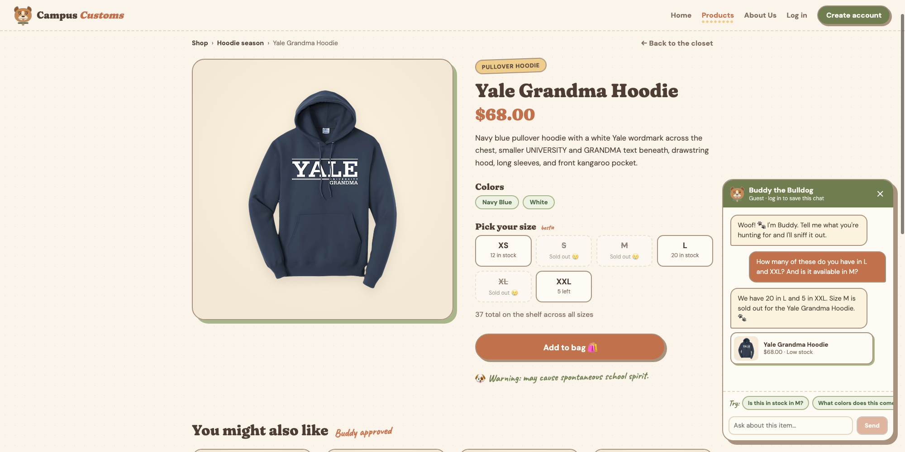
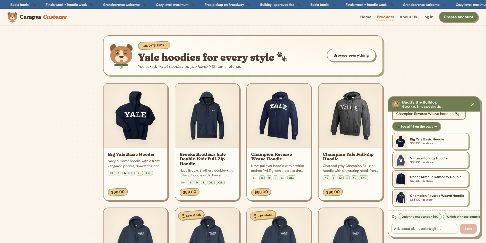
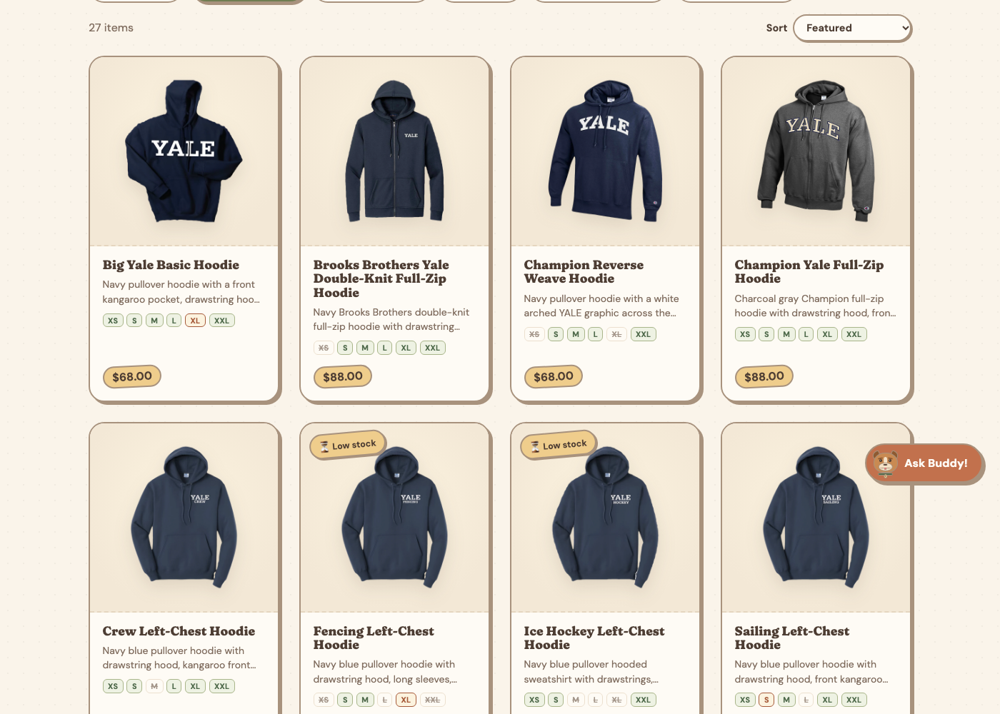

# Campus Customs: App Check

Three screenshots from the running site, each showing one feature working end to end.
(The same page as [`app_check.html`](app_check.html), in Markdown so the screenshots display when browsing this repository on GitHub.)

## 1. Chat gives the real stock from the database

**What it proves:** Buddy answers stock questions by calling the `check_stock` tool, which reads the `inventory` table in `campus_customs.db`. The numbers in his reply match the size boxes on the same product page, which load from the same table, and a sold-out size is stated plainly.

## 2. Hoodie cards pop up after asking the chat

**What it proves:** after asking "what hoodies do you have?", the agent sent back its matches as structured `page_results`. The website turned them into product cards (photo, name, price, short info) on the page, and each card opens that product's detail page.

## 3. Stock badges on the product cards (Problem 9)

**What it proves:** shoppers see availability before they click. Sizes that are sold out in the `inventory` table are crossed out on each card, nearly-gone sizes are amber, and products running low get a "Low stock" badge. No product is sold out in every size right now, so the all-sizes "Sold out" badge doesn't appear yet, but individual sold-out sizes do.
